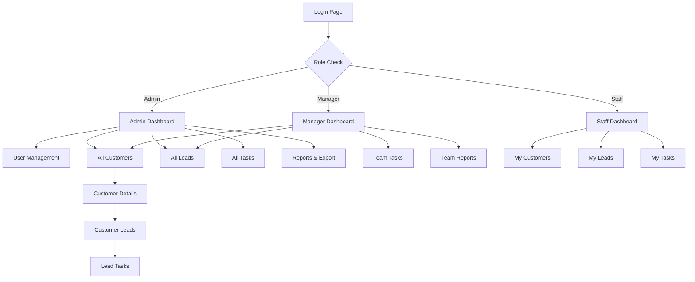

# Mini CRM Application - Product Requirements Document

## 1. Product Overview

A comprehensive Mini CRM (Customer Relationship Management) application built with PHP Laravel that enables businesses to manage customers, leads, and tasks efficiently with role-based access control and secure authentication.

The system addresses the core business need for organized customer data management, lead tracking, and task assignment while providing secure multi-user access with different permission levels for various organizational roles.

This CRM solution targets small to medium businesses looking for a robust, scalable customer management system with API integration capabilities for future expansion.

## 2. Core Features

### 2.1 User Roles

| Role | Registration Method | Core Permissions |
|------|---------------------|------------------|
| Admin | System registration with admin privileges | Full system access, user management, all CRUD operations |
| Manager | Admin invitation or registration with manager role | Customer and lead management, task assignment, view all data |
| Staff | Manager/Admin invitation or registration | Limited customer access, assigned tasks only, basic operations |

### 2.2 Feature Module

Our Mini CRM application consists of the following main pages:

1. **Authentication Pages**: User login, registration, and logout functionality with role-based redirects.
2. **Dashboard Page**: Summary statistics, recent activities display, and quick navigation to main modules.
3. **Customer Management Page**: Customer listing, creation, editing, and detailed customer profiles with associated leads.
4. **Leads Management Page**: Lead tracking, assignment, status updates, and customer relationship management.
5. **Tasks Management Page**: Task creation, assignment, status tracking, and due date management.
6. **User Management Page**: User role management, permissions, and account administration (Admin only).
7. **Reports & Export Page**: Data filtering, search functionality, and export capabilities for customer data.

### 2.3 Page Details

| Page Name | Module Name | Feature description |
|-----------|-------------|---------------------|
| Authentication Pages | Login System | Secure user authentication with email/password, role-based redirects, password reset functionality |
| Authentication Pages | Registration System | User account creation with role assignment, email verification, profile setup |
| Dashboard Page | Statistics Overview | Display total customers, leads count, pending tasks, conversion metrics |
| Dashboard Page | Recent Activities | Show last 10 system activities, user actions, task updates with timestamps |
| Dashboard Page | Quick Actions | Fast navigation buttons to create customer, lead, or task |
| Customer Management Page | Customer Listing | Paginated customer list with search, filter by status, company, sorting options |
| Customer Management Page | Customer CRUD | Create, read, update, delete customer records with validation |
| Customer Management Page | Customer Profile | Detailed customer view with associated leads, contact history, notes |
| Leads Management Page | Lead Listing | Paginated leads with filters by status, source, assigned user |
| Leads Management Page | Lead CRUD | Create, read, update, delete leads with customer assignment |
| Leads Management Page | Lead Assignment | Assign leads to users, status tracking, source management |
| Tasks Management Page | Task Listing | View tasks by assignment, due date, status with filtering |
| Tasks Management Page | Task CRUD | Create, read, update, delete tasks with lead association |
| Tasks Management Page | Task Authorization | Restrict task updates to assigned users only |
| User Management Page | User Administration | Create, edit, delete users, role assignment (Admin only) |
| User Management Page | Permission Management | Role-based access control, middleware enforcement |
| Reports & Export Page | Search & Filter | Advanced search by customer name, status, company, date ranges |
| Reports & Export Page | Data Export | Export customer data in CSV/Excel formats with custom field selection |

## 3. Core Process

### Admin Flow
1. Admin logs in and accesses the dashboard with full system statistics
2. Admin can create/manage users and assign roles (Admin, Manager, Staff)
3. Admin has full access to all customers, leads, and tasks across the system
4. Admin can generate reports and export data for business analysis
5. Admin manages system settings and user permissions

### Manager Flow
1. Manager logs in and views dashboard with team statistics
2. Manager can create and manage customers and leads
3. Manager assigns leads and tasks to staff members
4. Manager monitors team performance and lead conversion rates
5. Manager can access reports for their managed accounts

### Staff Flow
1. Staff logs in and sees personalized dashboard with assigned tasks
2. Staff can view and update customers they have access to
3. Staff works on assigned leads and updates their status
4. Staff manages only their assigned tasks and cannot reassign them
5. Staff can add notes and update task progress

## 4. User Interface Design

### 4.1 Design Style

- **Primary Colors**: Deep blue (#2563eb) for headers and primary actions, light blue (#dbeafe) for backgrounds
- **Secondary Colors**: Gray (#6b7280) for text, green (#10b981) for success states, red (#ef4444) for errors
- **Button Style**: Rounded corners (8px radius), solid primary buttons with hover effects, outline secondary buttons
- **Font**: Inter or system fonts, 14px base size, 16px for headings, 12px for captions
- **Layout Style**: Clean card-based design with consistent spacing, top navigation with sidebar for main modules
- **Icons**: Heroicons or Feather icons for consistency, minimal and professional appearance

### 4.2 Page Design Overview

| Page Name | Module Name | UI Elements |
|-----------|-------------|-------------|
| Authentication Pages | Login Form | Centered card layout, blue primary button, clean input fields with validation states |
| Dashboard Page | Statistics Cards | Grid layout with metric cards, charts for visual data, recent activity timeline |
| Dashboard Page | Navigation | Top navigation bar with user profile dropdown, sidebar with module icons |
| Customer Management Page | Customer List | Data table with pagination, search bar, filter dropdowns, action buttons |
| Customer Management Page | Customer Form | Two-column form layout, required field indicators, validation messages |
| Leads Management Page | Lead Cards | Card-based layout with status badges, assignment indicators, priority colors |
| Tasks Management Page | Task List | List view with due date indicators, status badges, checkbox for completion |
| User Management Page | User Table | Admin-only table with role badges, action buttons, modal forms |
| Reports & Export Page | Filter Panel | Collapsible filter sidebar, date pickers, multi-select dropdowns |

### 4.3 Responsiveness

The application is desktop-first with mobile-adaptive design. Key responsive features include:
- Collapsible sidebar navigation on mobile devices
- Responsive data tables that stack on smaller screens
- Touch-optimized buttons and form elements for mobile users
- Adaptive card layouts that reflow based on screen size
- Mobile-friendly date pickers and dropdown menus