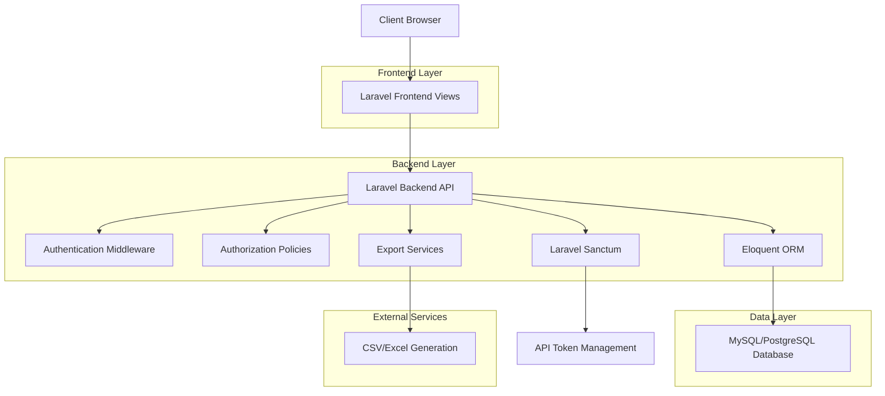
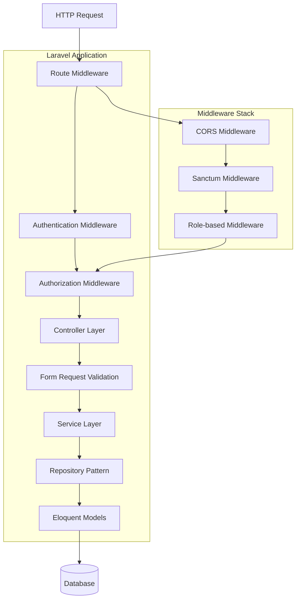
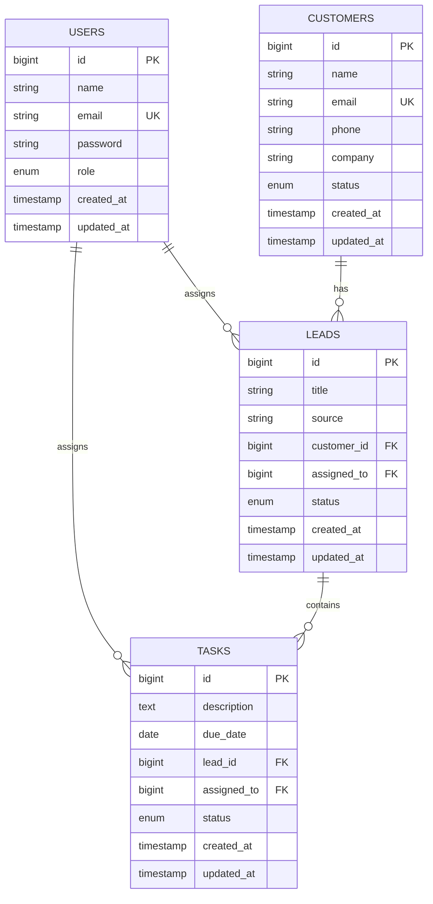

# Mini CRM Application - Technical Architecture Document

## 1. Architecture Design



## 2. Technology Description

- Frontend: Laravel Blade Templates + Bootstrap 5 + Alpine.js
- Backend: Laravel 10+ + PHP 8.1+
- Database: MySQL 8.0+ or PostgreSQL 13+
- Authentication: Laravel Sanctum + Built-in Auth
- Validation: Laravel Form Requests
- Export: Laravel Excel (Maatwebsite)

## 3. Route Definitions

| Route | Purpose |
|-------|---------|
| /login | User authentication page |
| /register | User registration page |
| /dashboard | Main dashboard with statistics and recent activities |
| /customers | Customer listing and management |
| /customers/create | Create new customer form |
| /customers/{id} | Customer detail view with associated leads |
| /customers/{id}/edit | Edit customer information |
| /leads | Lead listing and management |
| /leads/create | Create new lead form |
| /leads/{id} | Lead detail view with associated tasks |
| /leads/{id}/edit | Edit lead information |
| /tasks | Task listing and management |
| /tasks/create | Create new task form |
| /tasks/{id}/edit | Edit task information |
| /users | User management (Admin only) |
| /reports | Reports and export functionality |
| /api/dashboard/stats | API endpoint for dashboard statistics |
| /api/customers | RESTful API for customer operations |
| /api/leads | RESTful API for lead operations |
| /api/tasks | RESTful API for task operations |

## 4. API Definitions

### 4.1 Core API

#### Authentication
```
POST /api/auth/login
```

Request:
| Param Name | Param Type | isRequired | Description |
|------------|------------|------------|-------------|
| email | string | true | User email address |
| password | string | true | User password |

Response:
| Param Name | Param Type | Description |
|------------|------------|-------------|
| token | string | API authentication token |
| user | object | User information with role |

#### Dashboard Statistics
```
GET /api/dashboard/stats
```

Response:
| Param Name | Param Type | Description |
|------------|------------|-------------|
| total_customers | integer | Total number of customers |
| total_leads | integer | Total number of leads |
| pending_tasks | integer | Number of pending tasks |
| recent_activities | array | Last 10 system activities |

#### Customer Management
```
GET /api/customers
POST /api/customers
GET /api/customers/{id}
PUT /api/customers/{id}
DELETE /api/customers/{id}
```

Customer Request:
| Param Name | Param Type | isRequired | Description |
|------------|------------|------------|-------------|
| name | string | true | Customer full name |
| email | string | true | Customer email address |
| phone | string | true | Customer phone number |
| company | string | true | Customer company name |
| status | string | true | Customer status (active, inactive, prospect) |

#### Lead Management
```
GET /api/leads
POST /api/leads
GET /api/leads/{id}
PUT /api/leads/{id}
DELETE /api/leads/{id}
```

Lead Request:
| Param Name | Param Type | isRequired | Description |
|------------|------------|------------|-------------|
| title | string | true | Lead title/description |
| source | string | true | Lead source (website, referral, cold_call) |
| customer_id | integer | true | Associated customer ID |
| assigned_to | integer | true | Assigned user ID |
| status | string | true | Lead status (new, contacted, qualified, lost, won) |

#### Task Management
```
GET /api/tasks
POST /api/tasks
GET /api/tasks/{id}
PUT /api/tasks/{id}
DELETE /api/tasks/{id}
```

Task Request:
| Param Name | Param Type | isRequired | Description |
|------------|------------|------------|-------------|
| description | string | true | Task description |
| due_date | date | true | Task due date |
| lead_id | integer | true | Associated lead ID |
| assigned_to | integer | true | Assigned user ID |
| status | string | true | Task status (pending, in_progress, completed) |

## 5. Server Architecture Diagram



## 6. Data Model

### 6.1 Data Model Definition



### 6.2 Data Definition Language

#### Users Table
```sql
-- Create users table
CREATE TABLE users (
    id BIGINT UNSIGNED AUTO_INCREMENT PRIMARY KEY,
    name VARCHAR(255) NOT NULL,
    email VARCHAR(255) UNIQUE NOT NULL,
    email_verified_at TIMESTAMP NULL,
    password VARCHAR(255) NOT NULL,
    role ENUM('admin', 'manager', 'staff') DEFAULT 'staff',
    remember_token VARCHAR(100) NULL,
    created_at TIMESTAMP NULL,
    updated_at TIMESTAMP NULL
);

-- Create index
CREATE INDEX idx_users_role ON users(role);
CREATE INDEX idx_users_email ON users(email);
```

#### Customers Table
```sql
-- Create customers table
CREATE TABLE customers (
    id BIGINT UNSIGNED AUTO_INCREMENT PRIMARY KEY,
    name VARCHAR(255) NOT NULL,
    email VARCHAR(255) UNIQUE NOT NULL,
    phone VARCHAR(20) NOT NULL,
    company VARCHAR(255) NOT NULL,
    status ENUM('active', 'inactive', 'prospect') DEFAULT 'prospect',
    created_at TIMESTAMP NULL,
    updated_at TIMESTAMP NULL
);

-- Create indexes
CREATE INDEX idx_customers_status ON customers(status);
CREATE INDEX idx_customers_company ON customers(company);
CREATE INDEX idx_customers_name ON customers(name);
```

#### Leads Table
```sql
-- Create leads table
CREATE TABLE leads (
    id BIGINT UNSIGNED AUTO_INCREMENT PRIMARY KEY,
    title VARCHAR(255) NOT NULL,
    source ENUM('website', 'referral', 'cold_call', 'social_media', 'email') NOT NULL,
    customer_id BIGINT UNSIGNED NOT NULL,
    assigned_to BIGINT UNSIGNED NOT NULL,
    status ENUM('new', 'contacted', 'qualified', 'proposal', 'negotiation', 'won', 'lost') DEFAULT 'new',
    created_at TIMESTAMP NULL,
    updated_at TIMESTAMP NULL,
    
    INDEX idx_leads_customer_id (customer_id),
    INDEX idx_leads_assigned_to (assigned_to),
    INDEX idx_leads_status (status)
);
```

#### Tasks Table
```sql
-- Create tasks table
CREATE TABLE tasks (
    id BIGINT UNSIGNED AUTO_INCREMENT PRIMARY KEY,
    description TEXT NOT NULL,
    due_date DATE NOT NULL,
    lead_id BIGINT UNSIGNED NOT NULL,
    assigned_to BIGINT UNSIGNED NOT NULL,
    status ENUM('pending', 'in_progress', 'completed', 'cancelled') DEFAULT 'pending',
    created_at TIMESTAMP NULL,
    updated_at TIMESTAMP NULL,
    
    INDEX idx_tasks_lead_id (lead_id),
    INDEX idx_tasks_assigned_to (assigned_to),
    INDEX idx_tasks_status (status),
    INDEX idx_tasks_due_date (due_date)
);
```

#### Personal Access Tokens Table (Laravel Sanctum)
```sql
-- Create personal access tokens table for API authentication
CREATE TABLE personal_access_tokens (
    id BIGINT UNSIGNED AUTO_INCREMENT PRIMARY KEY,
    tokenable_type VARCHAR(255) NOT NULL,
    tokenable_id BIGINT UNSIGNED NOT NULL,
    name VARCHAR(255) NOT NULL,
    token VARCHAR(64) UNIQUE NOT NULL,
    abilities TEXT NULL,
    last_used_at TIMESTAMP NULL,
    expires_at TIMESTAMP NULL,
    created_at TIMESTAMP NULL,
    updated_at TIMESTAMP NULL,
    
    INDEX idx_personal_access_tokens_tokenable (tokenable_type, tokenable_id)
);
```

#### Initial Data Seeds
```sql
-- Insert default admin user
INSERT INTO users (name, email, password, role, created_at, updated_at) VALUES
('System Admin', 'admin@crm.local', '$2y$10$92IXUNpkjO0rOQ5byMi.Ye4oKoEa3Ro9llC/.og/at2.uheWG/igi', 'admin', NOW(), NOW()),
('Manager User', 'manager@crm.local', '$2y$10$92IXUNpkjO0rOQ5byMi.Ye4oKoEa3Ro9llC/.og/at2.uheWG/igi', 'manager', NOW(), NOW()),
('Staff User', 'staff@crm.local', '$2y$10$92IXUNpkjO0rOQ5byMi.Ye4oKoEa3Ro9llC/.og/at2.uheWG/igi', 'staff', NOW(), NOW());

-- Insert sample customers
INSERT INTO customers (name, email, phone, company, status, created_at, updated_at) VALUES
('John Doe', 'john@example.com', '+1234567890', 'Example Corp', 'active', NOW(), NOW()),
('Jane Smith', 'jane@sample.com', '+1987654321', 'Sample Inc', 'prospect', NOW(), NOW());

-- Insert sample leads
INSERT INTO leads (title, source, customer_id, assigned_to, status, created_at, updated_at) VALUES
('Website Inquiry', 'website', 1, 2, 'new', NOW(), NOW()),
('Referral Lead', 'referral', 2, 3, 'contacted', NOW(), NOW());

-- Insert sample tasks
INSERT INTO tasks (description, due_date, lead_id, assigned_to, status, created_at, updated_at) VALUES
('Follow up on website inquiry', '2024-01-15', 1, 2, 'pending', NOW(), NOW()),
('Schedule demo call', '2024-01-20', 2, 3, 'in_progress', NOW(), NOW());
```